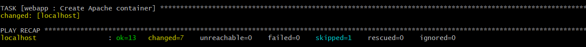
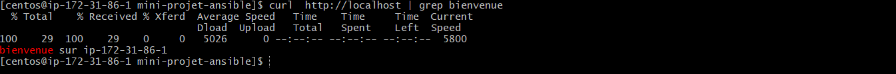
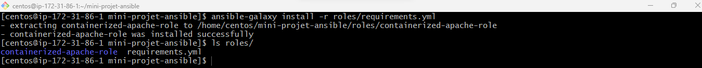
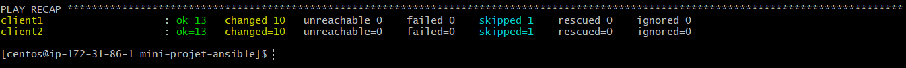
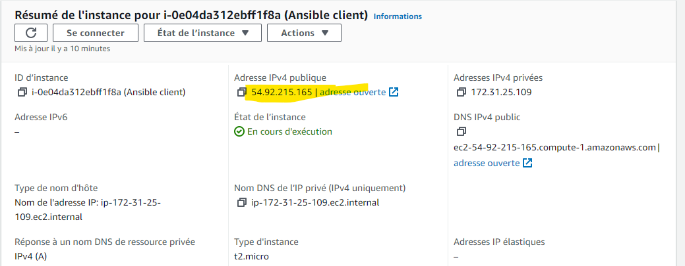
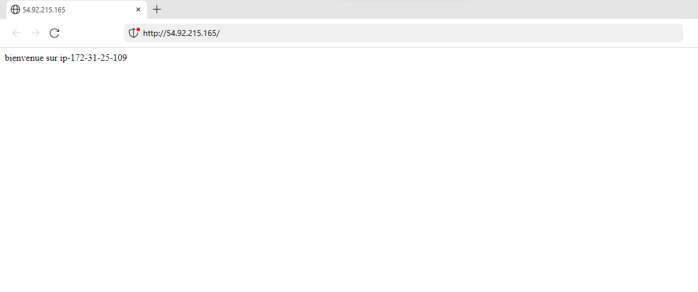
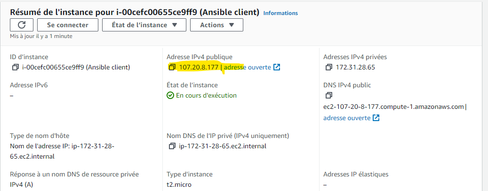
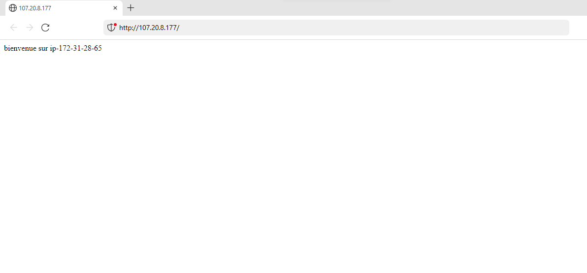

Prénom: Abdoul Gadirou

Nom: DIALLO

Promotion: BootCamp DevOps 17

# Ansible Mini-Project


# Ansible Role: [containerized-apache](https://github.com/abdel-dialo/containerized-apache-role.git)

This role allows you to install Docker on _centos_ machines and deploy an Apache httpd server in a container on these host machines.

# Supported platforms:
  - Centos

# Role structure
  See  [containerized-apache-role](https://github.com/abdel-dialo/containerized-apache-role.git)

# Variables
The variables used in this role are defined in the files defaults/main.yml and vars/main.yml. Here are some key variables:
- vars/main.yml:
    - _system_user_: System user under which the Docker container will be executed.
    -  _internal_port, external_port_ * : Apache server container internal port and external port
    -  _template_file_ : template file

# Dependencies
  ``` 
   pip
   get_url
   fail
   package
   meta
   command
   service
   template
   docker_container
   ```

# Deployment the containerized-apache-role
   The role deployment tasks are located in the _tasks/main.yml_ file.
   
   Deployment steps:

  - Include install-docker, pre-setup tasks
  - Starting the docker service: Once the Docker installation is complete, force the start of the docker service using the _start_service_docker_ handler
  - Copy the index.html file to the target host directory
   directory which will be the mount point of the Apache container on the target host.
  - Create and start the Apache httpd container.
  

# Test the containerized-apache-role
 Go to project root
 
 `ansible-playbook roles/webapp/tests/test.yml`
  
`curl http://localhost  | grep bienvenue`
  


# Example of deployment on AWS EC2 hosts
   - Prerequisites: Have two AWS EC2 machines running with a key pair and ssh, http ports opened
   - Host configuration
     - In the _group_vars/all.yml_ file enter the following variables:
       - **ansible_ssh_user**: enter the user of the remote host (in our case the user is _centos_)
       - **ansible_ssh_private_key_file**: contains the path of the file containing the ec2 key pair
     - In the files _host_vars/client1.yml_ _host_vars/client2.yml_ enter the IP addresses of the hosts.
     - In the _ansible.cfg_ configuration file, enter the following variables:
       - **host_key_checking**: set this variable to _False_
       - **inventory**: enter the path of the inventory file
       - **roles_path**: enter the path of the roles
   - Setting up the role

       ```ansible-galaxy install -r roles/requirements.yml```
       

   - Deployment of the role on the different machine after configuration
        ```ansible-playbook deploy.yml```
       
       
       
       
       


